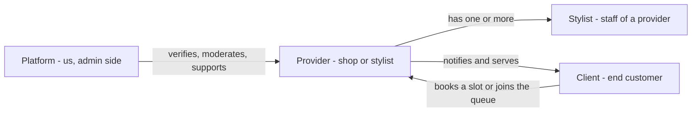
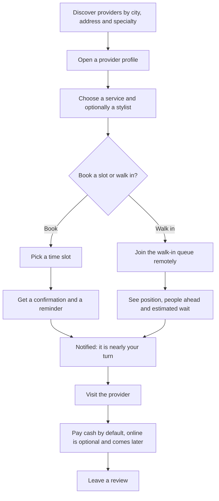
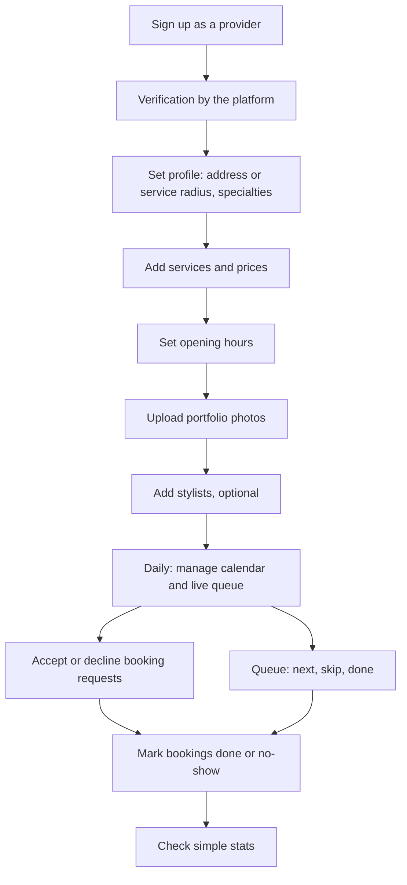
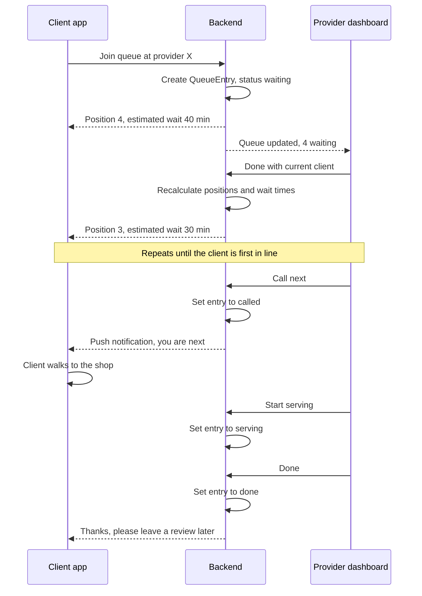
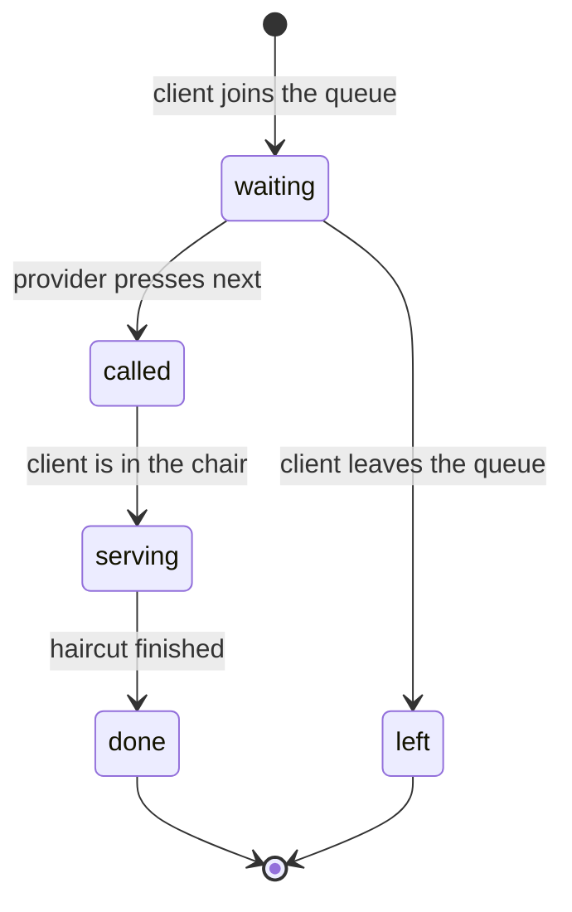
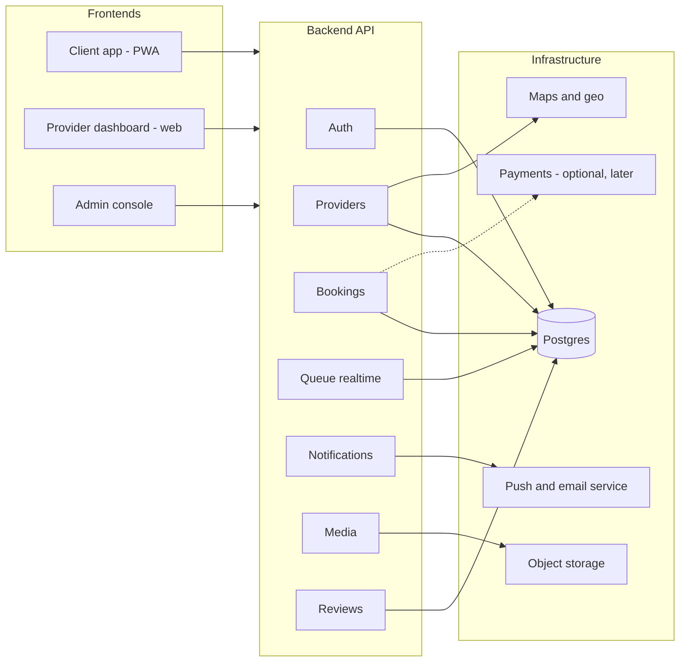
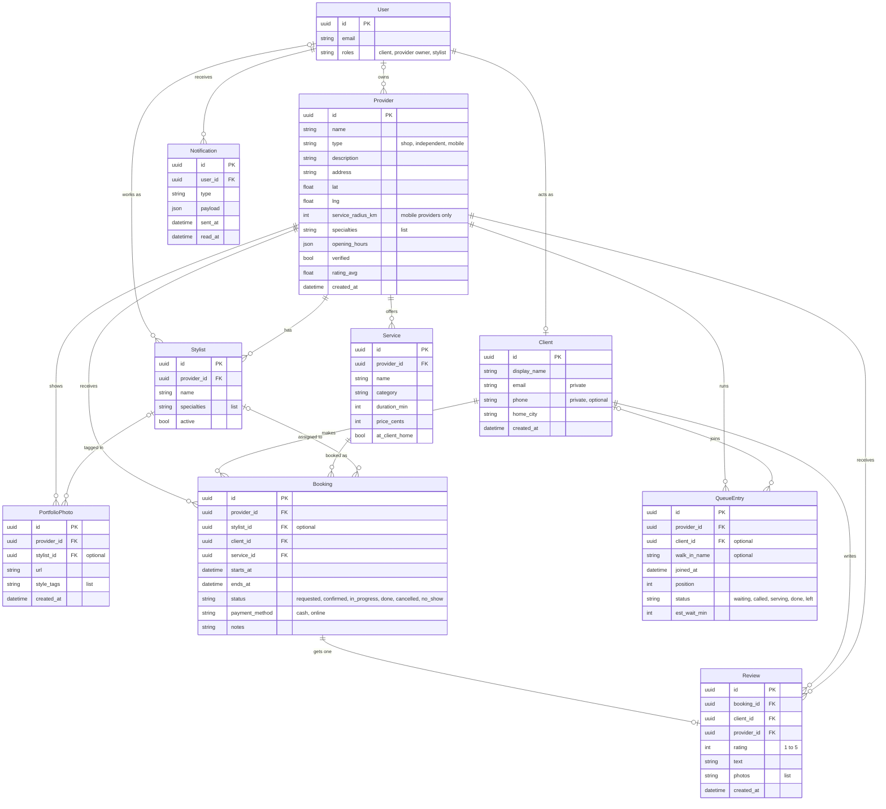

# App sketch – project-next

**Purpose:** this page is the written and visual sketch of how the app works: roles, user flows, screens, architecture, data model and MVP scope. It is the starting point for discussion and for the first issues. The product vision and the "why" live in [vision.md](vision.md).

**One-line pitch:** a booking and walk-in queue platform for barbers and hairdressers – the delivery-app model ("Lieferando for barbers and hairdressers") applied to barbershops.

**Status:** Draft v0.1 – proposal, to be discussed.

---

## 1. Roles

We use exactly these words everywhere: **Platform**, **Provider**, **Stylist**, **Client**.

> **Provider = the platform's customer (shop or stylist). Client = the provider's customer.**

| Role | Who | What they do | Which app they use |
|---|---|---|---|
| **Platform** | Us, the admin side | Verifies providers, moderates photos and reviews, gives support, watches metrics, configures pricing | Admin console |
| **Provider** | A barbershop, a hair salon, or an independent or mobile stylist (barber, braider, hairdresser) | Sets up a profile, services, prices, hours, photos and staff; runs the calendar and the walk-in queue; accepts bookings | Provider dashboard (web) |
| **Stylist** | A staff member of a provider; a one-person provider is also its own stylist | Gets assigned to bookings and queue entries; can be tagged in portfolio photos | Provider dashboard (limited view) |
| **Client** | The end customer who gets a haircut | Discovers providers, books a slot or joins the walk-in queue, gets notified, visits, pays cash, leaves a review | Client app (mobile-first web, PWA) |

---

## 2. User flows

### 2.1 Client flow

A client should get from "I need a haircut" to "I am in the chair" without handing out a phone number.

Notes:

- Discovery filters: specialty (African hair, Turkish barber, braids, locs, extensions, beard, women's or men's, kids), "comes to your place" vs "you go there", price range, open now.
- Booking management: reminders, cancel and reschedule, booking history, favourites.
- Communication is in-app only. No phone numbers are exchanged.

### 2.2 Provider flow

Notes:

- Verification gives a badge. Trust also comes from reviews and the portfolio.
- The provider sets all prices. The platform never forces online payment or invoicing.

### 2.3 Walk-in queue – the key feature

This is what makes the app different from a plain booking tool. The client joins from their phone and sees how many people are ahead. The provider only presses next and done.

QueueEntry status lifecycle:

The estimated wait is simple at first: people ahead multiplied by the average service duration of that provider. It can get smarter later.

---

## 3. Screens

### 3.1 Client app

| Screen | Purpose | Key elements | MVP |
|---|---|---|---|
| Home / Search | Find a provider | City or address input, specialty chips, "comes to you" toggle, open now | Yes |
| Results list & map | Compare providers nearby | Cards with photo, rating, price from, distance, "queue: 3 waiting"; map with pins | Yes (list), map simple |
| Provider profile | Decide and act | Portfolio photos, services with prices, hours, location or radius, reviews, verified badge, two buttons: Book, Join queue | Yes |
| Service & time picker | Book an appointment | Service list, optional stylist, available slots, notes field, confirm | Yes |
| Queue status | Live wait | Position, people ahead, estimated wait, leave queue button, "you are next" state | Yes |
| My bookings | Manage visits | Upcoming and past, cancel or reschedule, favourites, rebook | Yes (basic) |
| Review | Rate a done booking | Stars 1 to 5, text, optional photos | Yes |
| Profile / settings | Account and privacy | Display name, home city, notification settings, delete account | Yes (basic) |

### 3.2 Provider dashboard

| Screen | Purpose | Key elements | MVP |
|---|---|---|---|
| Onboarding wizard | Get a provider live fast | Type (shop, independent, mobile), address or radius, specialties, services and prices, hours, photos, stylists, verification upload | Yes |
| Today | The one screen for a working day | Today's calendar per stylist on the left, live queue on the right, big Next and Done buttons | Yes |
| Calendar | Plan the week | Week view per stylist, block times, drag to move, booking requests to accept or decline | Yes (basic) |
| Queue board | Run the walk-in queue | Ordered list, next, skip, done, add walk-in by name, live wait estimate | Yes |
| Services & prices | Keep the menu current | Name, category, duration, price, at client's home flag | Yes |
| Portfolio | Show evidence of work | Upload photos, tag by style, tag stylist, reorder | Yes |
| Stylists / team | Manage staff | Add or deactivate stylists, specialties, working hours | Yes (basic) |
| Stats | Simple numbers | Bookings per week, popular services, no-show rate, revenue estimate (cash tracked optionally) | No, v0.2 |
| Settings / verification | Account and trust | Profile edit, verification status and documents, notification settings | Yes |

### 3.3 Admin console (short)

| Screen | Purpose | MVP |
|---|---|---|
| Provider verification | Review ID or business documents, grant or revoke the badge | Yes |
| Moderation | Review reported photos and reviews, hide or delete | Yes (basic) |
| Metrics | Providers, clients, bookings, queue joins per city and week | Yes (basic) |

---

## 4. Architecture (PROPOSAL)

This is a proposal, not a decision. The decision is taken in [decisions/0001-tech-stack.md](decisions/0001-tech-stack.md) (ADR-0001, status: proposed).

Proposed stack per layer:

| Layer | Proposal | Alternative |
|---|---|---|
| Repo | Monorepo in this GitHub repo | – |
| Frontend | TypeScript + React (Next.js), responsive PWA first; client app and provider dashboard as two apps or one app with roles | Flutter for mobile and web, if the team prefers |
| Backend | Supabase: Postgres, Auth, Realtime for the live queue, Storage for photos. Chosen to move fast with three part-time people | Node/NestJS + Postgres + WebSockets |
| Notifications | Web push + email first | SMS and WhatsApp later |
| Maps / geo | PostGIS, or simple lat/lng + radius; map tiles via OpenStreetMap/Leaflet | Start with lat/lng + radius, add PostGIS when needed |
| Payments | Later and optional: Stripe or PayPal | None; cash stays the default |
| Hosting / CI | Vercel (frontend) + Supabase; GitHub Actions for CI | – |
| Native apps | Later; the PWA comes first | – |

---

## 5. Data model

Entities and fields as proposed for v0.1. Keep names consistent across docs and code.

Key fields explained:

- **User / roles:** one account can be a client and a provider owner or stylist at the same time.
- **Provider.type / service_radius_km:** `shop`, `independent` or `mobile`. A shop has an address. A mobile provider has a base location plus a `service_radius_km` and comes to the client. Discovery uses `lat`, `lng` and the radius.
- **Service.at_client_home:** true when this service is done at the client's place. A provider can offer both kinds.
- **Booking.status:** `requested` (client asked), `confirmed` (provider accepted), `in_progress`, `done`, `cancelled`, `no_show`. Only a `done` booking can get a review.
- **Booking.payment_method:** `cash` (default) or `online` (later, optional, never required).
- **QueueEntry.status:** `waiting`, `called`, `serving`, `done`, `left`. See the state diagram above.
- **QueueEntry.client_id / walk_in_name:** app users have a `client_id`; people who walk in off the street get just a name.
- **Client.email / phone:** private. Never shown to a provider. Contact runs through in-app notifications.

---

## 6. MVP scope v0.1 vs later

| MVP v0.1 | Later |
|---|---|
| Provider profile with services, prices and portfolio | Online payment (Stripe or PayPal) |
| Client discovery by city and specialty | Multi-stylist scheduling optimisation |
| Simple appointment booking, no payment | Loyalty |
| Walk-in queue with "people ahead of me" | Product sales (hair extensions, colour ordering idea from the meeting) |
| Notifications: push and email | Other service categories |
| Provider dashboard: calendar + queue | Other countries |
| Reviews after a done booking | Native apps |
| Admin provider verification | WhatsApp integration |

Rule of thumb: if a feature is not needed for one barber in one city to run a day with the app, it is not in v0.1.

---

## 7. Non-functional notes

- **Mobile-first.** Clients use their phone, often in the street. Big buttons, fast load, PWA on the home screen. The provider dashboard must also work on a tablet next to the chair.
- **Realtime for the queue.** Position and wait time must update within seconds, without refresh. This is the main reason for Supabase Realtime or WebSockets in the proposal.
- **Privacy.** No phone numbers are exposed between client and provider in either direction. All contact goes through in-app notifications and, later, messages.
- **GDPR.** EU hosting, account export and delete, keep only the data we need.
- **Photo moderation.** Portfolio and review photos can be reported and hidden by the platform. Rules come with the terms.
- **Cash is the default.** No feature may depend on online payment. Revenue in stats is an estimate the provider can switch off.
- **Low friction for providers.** Many are not registered businesses. Ask for the minimum at onboarding.

---

## 8. Open questions

Taken from the kickoff; not decided yet.

- Name and brand (brainstorm in [ideas.md](ideas.md)); legal form; who owns what; time budget per person.
- Build fresh or reuse Alex's existing general service-marketplace code (Service Scout)?
- First cities; first 5 to 10 pilot providers; survey questions for barbers.
- Pricing model and when to switch from free to paid.
- Legal: GDPR, Impressum, terms, handling providers who are not registered businesses, review law.
- Tech stack: see the proposal above and [decisions/0001-tech-stack.md](decisions/0001-tech-stack.md); to be decided at the next meeting.
- Sketch-specific: one Next.js app with roles or two apps? How do we estimate wait time before we have data? Does a stylist get their own login in v0.1?

## 9. How to contribute to this sketch

- Edit this file via a pull request.
- New ideas go to [ideas.md](ideas.md), not here.
- Concrete tasks go to [todo.md](todo.md) with an owner.
- The interactive HTML version of this sketch lives in [index.html](index.html). When you change a flow, screen or entity here, update it there too in the same PR, so both stay in sync.
- Diagrams are Mermaid; GitHub renders them. Quote labels that contain punctuation.
